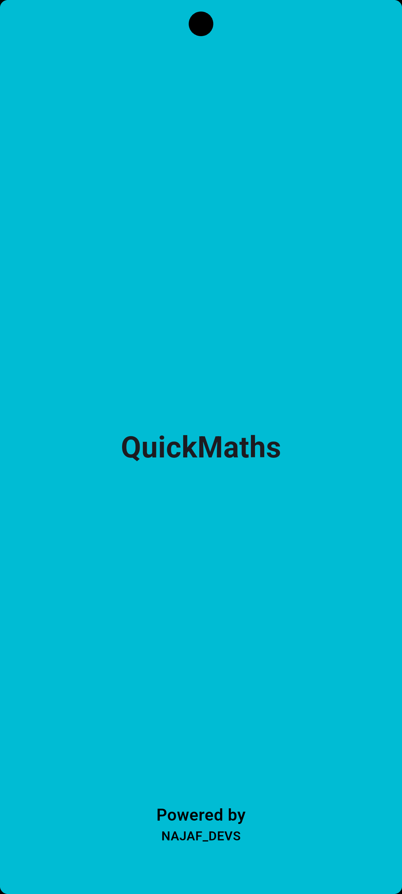
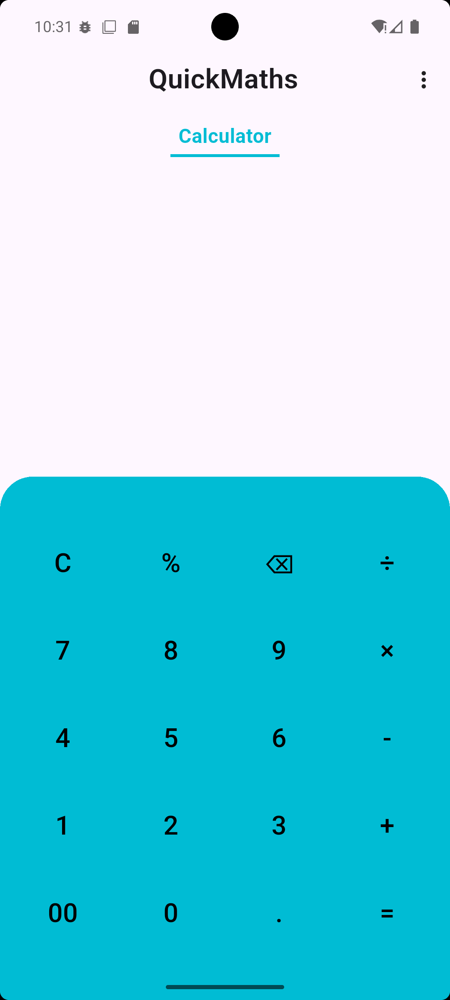
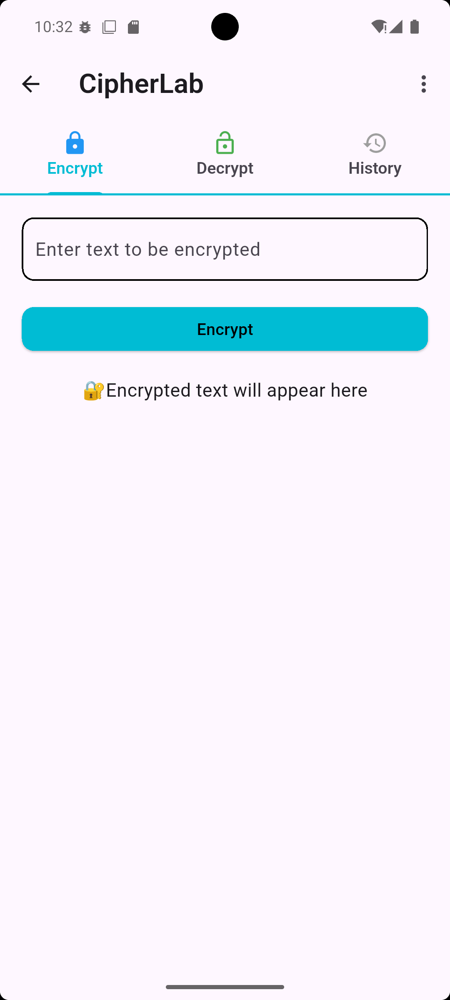
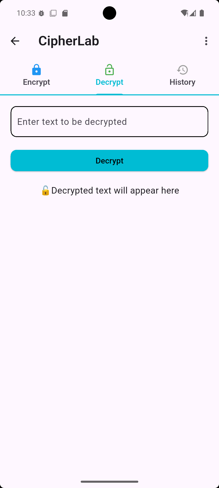
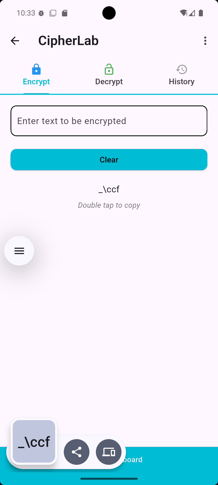
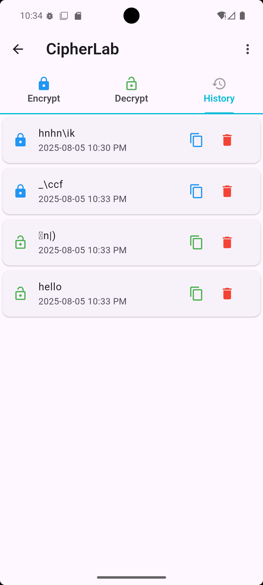
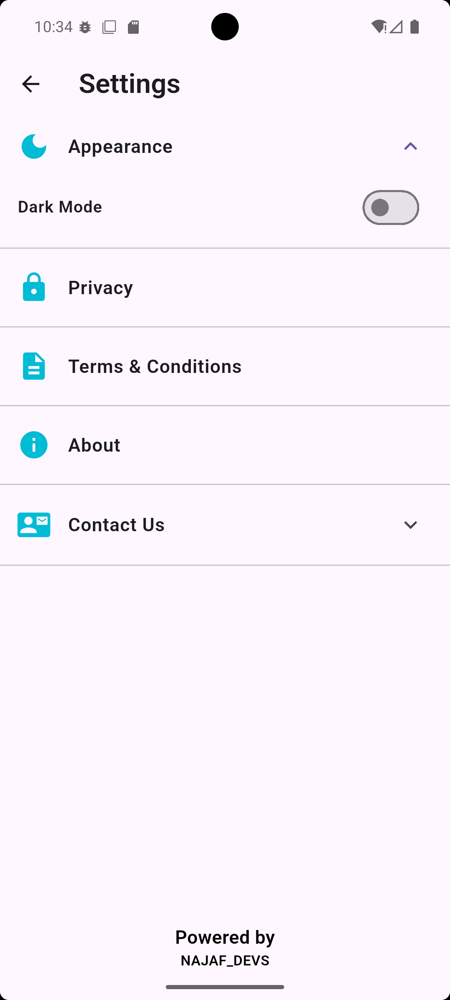
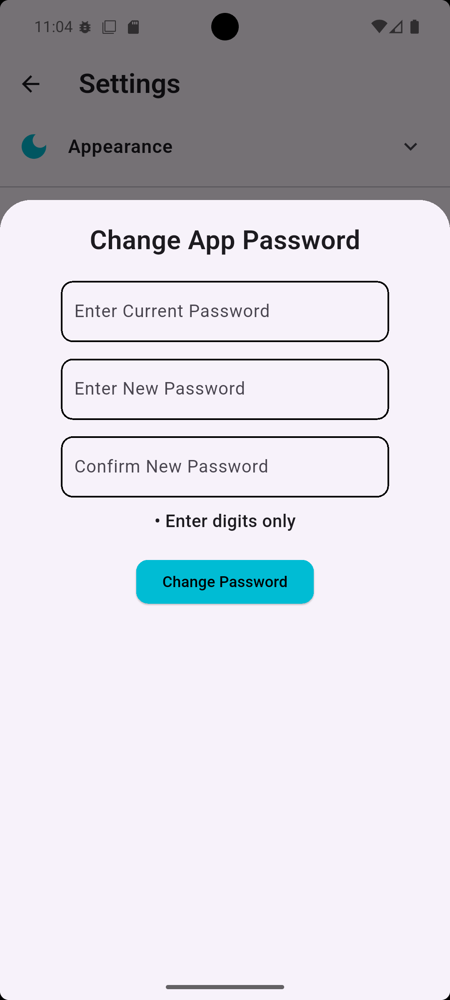

# QuickMaths

QuickMaths is a versatile Flutter application that combines a fully functional calculator with a secure cipher lab for encrypting and decrypting messages.

The app launches first to a sleek calculator screen, providing basic and advanced calculations. To access the cipher lab, users must enter a default password — **1234** — ensuring secure access to encrypted messaging features.

The cipher lab supports multiple encryption methods, maintains a real-time history of encrypted and decrypted texts, and allows theme customization. The app uses **Provider** for efficient state management, ensuring smooth UI updates and a responsive user experience.

QuickMaths is designed to be user-friendly, customizable, and secure, all wrapped in an elegant Flutter UI.

## Features

- **Calculator:** Basic and advanced calculations on launch screen.
- **Secure Cipher Lab:** Password-protected access (default password: `1234`).
- **Encryption & Decryption:** Multiple methods to encrypt and decrypt text messages.
- **History:** Real-time message history of all encryption/decryption activities.
- **Theme Customization:** Light and dark mode themes.
- **State Management:** Uses Provider for scalable and efficient app state handling.
- **User-Friendly UI:** Responsive design with splash screen and smooth navigation.

## Screenshots

Below are some screenshots showcasing the app’s UI and features:

<table>
  <tr>
    <td></td>
    <td></td>
    <td></td>
    <td></td>
  </tr>
  <tr>
    <td></td>
    <td></td>
    <td></td>
    <td></td>
  </tr>
</table>

## Getting Started

### Prerequisites

- Flutter SDK (version 3.0 or above recommended)
- Dart SDK
- Device or emulator to run the app

### Installation

1. Clone the repository:

    ```bash
    git clone https://github.com/your-username/quickmaths.git
    ```

2. Navigate to the project directory:

    ```bash
    cd quickmaths
    ```

3. Install dependencies:

    ```bash
    flutter pub get
    ```

4. Run the app:

    ```bash
    flutter run
    ```

## Usage

- On launch, use the calculator screen for basic calculations.
- To access the cipher lab, enter the password **1234** when prompted.
- Use the cipher lab to encrypt or decrypt text messages.
- View your encryption/decryption history in the History tab.
- Customize themes and encryption settings in the Settings screen.

## State Management

This app uses **Provider** for state management, handling:

- Theme changes (Light/Dark modes)
- Encryption/decryption history updates
  

Provider ensures efficient UI rebuilds and a smooth user experience.

## Contributing

Contributions are welcome! Feel free to open issues or submit pull requests for bug fixes, improvements, or new features.

## License

This project is licensed under the MIT License. See the [LICENSE](LICENSE) file for details.
